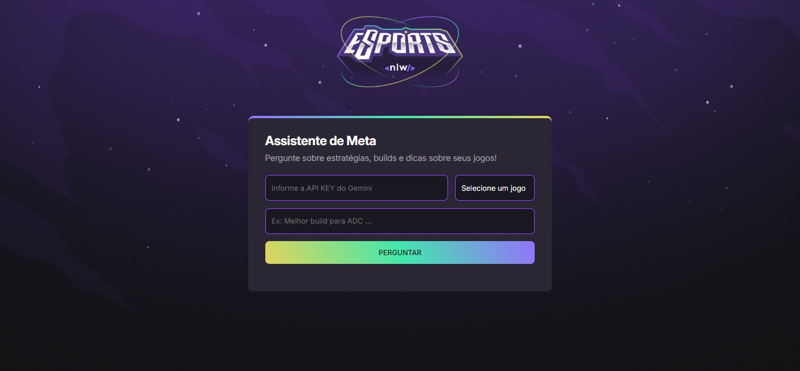

# 🎮 Assistente de Meta - NLW eSports

Projeto desenvolvido durante o evento **NLW Agents - Iniciante** da Rocketseat, entre **07/07/2025** e **25/07/2025**, com foco em criar um assistente de estratégias para games usando **Inteligência Artificial**.

## 📌 Sobre o projeto
O **Assistente de Meta** é uma aplicação web que permite ao usuário fazer perguntas sobre estratégias, builds e dicas de jogos como:

- Valorant
- League of Legends
- CS:GO

O sistema consome a **API do Google Gemini** para gerar respostas curtas, diretas e atualizadas, seguindo regras pré-definidas.

## 🚀 Tecnologias utilizadas
- HTML5
- CSS3
- JavaScript
- Google Gemini API
- Showdown.js (conversão de Markdown para HTML)

## 🧠 Funcionalidades
- Campo para inserir sua **API Key** do Gemini
- Seleção de jogo
- Caixa de pergunta personalizada
- Resposta processada em **Markdown**
- Interface com animações e gradientes estilizados

## ▶ Como executar
1. **Baixe ou clone este repositório**  
2. Abra o arquivo `index.html` no navegador  
3. Informe sua **API Key** do Gemini  
4. Escolha um jogo, faça sua pergunta e receba a resposta!  

## 📜 Certificado
Este projeto foi desenvolvido durante o evento **NLW Agents - Iniciante** da Rocketseat, totalizando **5 horas** de imersão.

📄 [Ver certificado](https://app.rocketseat.com.br/certificates/e1e7bf7a-5809-4f97-a2ec-0b8d6d635b27)
